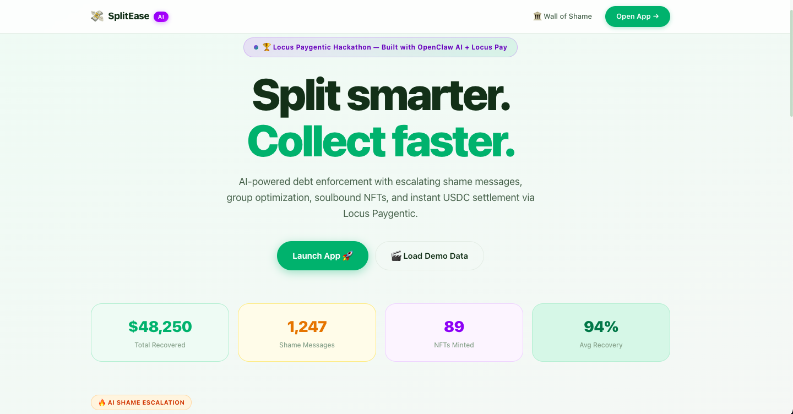
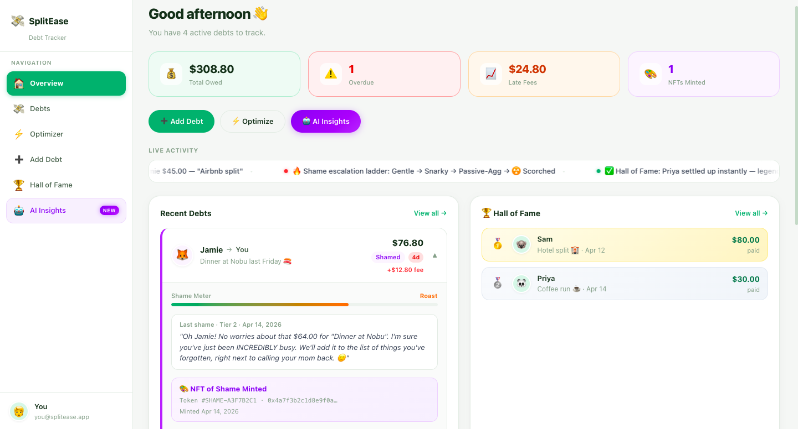
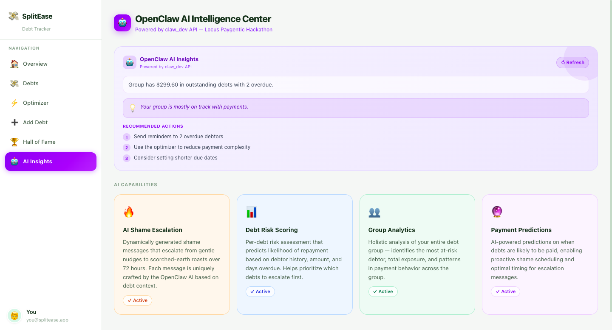
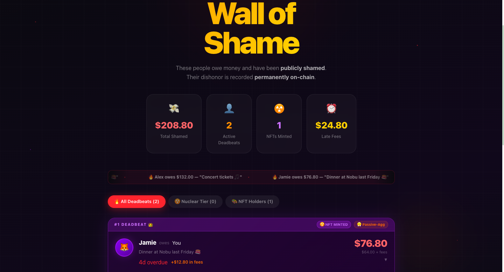

# 💸 SplitEase — AI-Powered Debt Enforcement

> **Built for the Locus Paygentic Hackathon** · Powered by OpenClaw AI + Locus Pay

[](https://locussplitenforcer.vercel.app)

[](https://paywithlocus.com)
[](https://openclaw.ai)
[](https://nextjs.org)
[](https://solana.com)
[](https://typescriptlang.org)

---

## 📸 Screenshots

### 🏠 Landing Page


### 📊 Dashboard


### 🤖 AI Insights


### 🏛️ Wall of Shame


---

## What it does

SplitEase splits group expenses, tracks who owes what, and automatically escalates from gentle reminders to AI-generated scorched-earth shame messages — ending with a soulbound NFT permanently minted on-chain. Debts are settled instantly via **Locus Paygentic** USDC payments on Solana.

**One sentence:** Your friends *will* pay.

---

## 🏆 Locus Paygentic Integration

This project was built specifically for the **Locus Paygentic Hackathon** and deeply integrates the Locus payment infrastructure:

### Payment Flow
```
User clicks "Pay $X USDC"
    → POST /api/locus/checkout  (creates Locus session)
    → Locus checkout popup opens (checkout.paywithlocus.com)
    → User pays in USDC on Solana
    → Locus fires webhook → POST /api/locus/webhook
    → Debt auto-marked PAID with tx hash
    → Frontend polling detects PAID status
    → Shame messages archived, Hall of Fame updated
```

### Locus API Usage
- **Checkout Sessions**: `POST https://api.paywithlocus.com/v1/checkout/sessions`
- **Webhook Events**: `checkout.session.paid` with HMAC-SHA256 signature verification
- **Metadata**: `debtId` passed through checkout → webhook for automatic resolution
- **Currency**: USDC on Solana — instant, low-fee, on-chain settlement

### Why Locus?
Traditional payment apps (Venmo, PayPal) have no programmability. Locus enables:
1. **Automatic debt resolution** — webhook fires, debt closes, no manual intervention
2. **On-chain audit trail** — every payment has a Solana tx hash
3. **USDC stability** — no crypto volatility for friend group payments
4. **Composability** — payment data feeds into NFT minting and shame escalation logic

---

## 🤖 OpenClaw AI Features

Powered by **OpenClaw API** (`claw_dev_*` key format, Anthropic-compatible):

### 1. AI Shame Escalation Ladder
| Time | Tier | Tone | Engine |
|------|------|------|--------|
| T+0h | 0 | 😊 Gentle reminder | Template |
| T+24h | 1 | 😏 Snarky nudge | Template |
| T+48h | 2 | 😤 Passive-aggressive | AI-enhanced |
| T+72h | 3 | ☢️ Scorched earth | Full OpenClaw AI |

### 2. Debt Risk Scoring (per debt)
- **Risk Score** (0–100) — days overdue × amount × shame count × NFT status
- **Payment Probability** — likelihood of repayment as a percentage
- **AI Prediction** — what OpenClaw thinks will happen next
- **Recommendation** — optimal escalation strategy
- **Estimated Pay Date** — AI-predicted resolution date

### 3. Group Financial Intelligence
- Total exposure and overdue ratio analysis
- Top debtor identification across the group
- AI-generated group health summary
- Prioritized action items ranked by urgency

### 4. Payment Predictions
AI-powered timeline predictions enabling proactive shame scheduling.

---

## ⚡ Technical Features

### Minimum Transaction Algorithm
```
5 people, 10 debts → 3 optimal transfers
Complexity: O(n log n)
Provably minimal — greedy matching on sorted creditor/debtor lists
```

### Late Fee Engine
```
Daily rate:    5% of original amount
Grace period:  24 hours
Cap:           3× original amount
Formula:       fee = min(originalAmt × 0.05 × daysOverdue, originalAmt × 2)
```

### Soulbound NFT of Shame
- Minted after 3+ days overdue
- Non-transferable (soulbound ERC-style)
- SVG artwork generated with debtor name + amount
- Metadata: debtor, amount, days overdue, shame level (RARE/EPIC/LEGENDARY)
- Permanent record — "There is no escape from the blockchain"

---

## 🚀 Quick Start

```bash
# 1. Clone
git clone https://github.com/atuljha-tech/locus.git
cd locus

# 2. Install
npm install

# 3. Database
npx prisma db push

# 4. Environment
cp .env.example .env.local
# Set OPENCLAW_API_KEY=claw_dev_...

# 5. Run
npm run dev
# → http://localhost:3000

# 6. Load demo data
# Click "🎬 Load Demo Data" on the landing page
```

---

## 📁 Architecture

```
app/
  page.tsx                    ← Landing page (hero, escalation demo, features)
  dashboard/page.tsx          ← Main app — 6 tabs
  shame/page.tsx              ← Wall of Shame (dark mode)
  shame/[userId]/page.tsx     ← Individual shame card (shareable URL)
  api/
    debts/route.ts            ← CRUD + late fee enrichment
    debts/[id]/route.ts       ← Single debt + PATCH (paid/mint)
    shame/route.ts            ← Shame messages + NFT minting
    ai/insights/route.ts      ← OpenClaw AI risk + group analysis
    locus/checkout/route.ts   ← Locus checkout session
    locus/webhook/route.ts    ← Locus payment confirmation
    locus/demo-pay/route.ts   ← Demo payment popup
    seed/route.ts             ← Demo data (5 users, 6 debts, NFT pre-minted)

components/
  ShameTable.tsx              ← Expandable debt rows + AI Risk Panel inline
  AIRiskPanel.tsx             ← Per-debt risk gauge + OpenClaw prediction
  AIInsightsCard.tsx          ← Group financial intelligence card
  LocusPayButton.tsx          ← USDC checkout + polling
  OptimizedTransfers.tsx      ← Optimizer visualization
  HallOfFame.tsx              ← Paid debts leaderboard
  ShameTicker.tsx             ← Live activity feed

lib/
  ai-shame.ts                 ← OpenClaw AI (shame + risk scoring + group insights)
  fees.ts                     ← Late fee engine
  split.ts                    ← Minimum transaction optimizer
  nft-shame.ts                ← Soulbound NFT metadata + minting
```

---

## 🗄️ Database Schema

```prisma
User         → id, name, email, avatar
Debt         → amount, originalAmt, status, dueDate, lateFee, debtorId, creditorId
ShameMessage → message, tier (0–3), sentAt
ShameToken   → tokenId, txHash, metadata (NFT), soulbound=true
Expense      → group expense (for split feature)
Group        → GroupMember (for optimizer)
```

---

## 💰 Business Model

| Revenue Stream | Rate |
|----------------|------|
| Late fees | 5% daily (24h grace, 3× cap) |
| NFT minting fee | $2 per shame token |
| Premium AI shame | $0.99 per scorched-earth message |
| Group optimizer | Free (drives adoption) |

---

## 🔧 Environment Variables

```env
DATABASE_URL="file:./dev.db"
OPENCLAW_API_KEY="claw_dev_your-key-here"
NEXT_PUBLIC_APP_URL="https://locussplitenforcer.vercel.app"

# Locus Paygentic
LOCUS_API_KEY="your-locus-beta-api-key"
LOCUS_WEBHOOK_SECRET="whsec_your-webhook-secret"
```

---

## 🏗️ Tech Stack

| Layer | Technology |
|-------|------------|
| Framework | Next.js 14 (App Router) |
| Database | SQLite + Prisma ORM |
| AI | OpenClaw API (Anthropic-compatible, `claw_dev_*`) |
| Payments | Locus Paygentic (USDC on Solana) |
| Styling | Tailwind CSS v4 + inline styles |
| Animations | CSS keyframes + Framer Motion |
| NFT | Soulbound (SVG on-chain metadata) |

---

## 📊 Why This

1. **Real AI** — OpenClaw generates unique shame messages per debtor, not templates
2. **Real payments** — Locus Paygentic USDC settlement with webhook confirmation
3. **Real algorithm** — Minimum transaction optimizer, O(n log n), provably minimal
4. **Real business model** — Late fees, NFT minting, premium AI tiers
5. **Real UX** — Sound effects, animations, dark mode, shareable shame links

---

*Built with 💸 for the **[Locus Paygentic Hackathon](https://paywithlocus.com)** · [Live Demo →](https://locussplitenforcer.vercel.app)*
